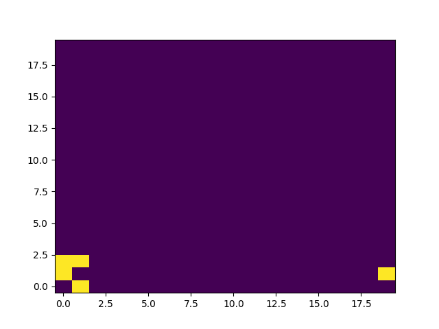

# `automancer` – a cellular automata simulator
`automancer` allows you to simulate systems of cellular automata using any
arbitrary ruleset you can think of. The library is simple (though not 
very well written), relatively easy to use, and is somewhat fast, and can handle
any kind of 2d uniform grid you can throw at it.

Rules are defined explicitly as functions, unlike [`cellular_automaton`][ca]
where they are defined as methods in classes, and [CellPyLib][cpl] where they
are defined by either Wolfram codes or functions. This is neither good nor bad,
it's just different. As an example, here I have defined a system for Conway's
game of life with a Moore neighborhood with area 1.
```python
def game_of_life(state, neighborhood, point):
    neighbors = count_neighbors(state, point, neighborhood)
    if state[point] == 1:
        if neighbors < 2 or neighbors > 3:
            return [(point, 0)]
        elif neighbors == 2 or neighbors == 3:
            return [(point, 1)]
    elif state[point] == 0:
        if neighbors == 3:
            return [(point, 1)]
        else:
            return [(point, 0)]

glider_state = np.array([
    [0, 0, 1],
    [1, 0, 1],
    [0, 1, 1]
    ])
glider_state = np.flip(glider_state, axis = 1)

game = CellularAutomata((20, 20))
game.state[0:3, 0:3] = glider_state
game.add_neighborhood(shape = 'm', size = '1')
game.add_rule(game_of_life)
```



I wrote this primarily to get a better handle on cellular automata, because I
just think that they're cool—if you're going to be using something for your
research, I would suggest you just use [CellPyLib][cpl] instead of `automancer`,
since this program is not feature complete and it's also not really compatible
with most of the lingo used for cellular automata research.

You can read more about cellular automata on [*MathWorld*][mw] or
[*Wikipedia*][wiki].


[mw]: https://mathworld.wolfram.com/CellularAutomaton.html

[wiki]: https://en.wikipedia.org/wiki/Cellular_automaton

## See also
+ [CellPyLib][cpl]
+ [cellular_automaton][ca]

[cpl]: https://en.wikipedia.org/wiki/Cellular_automaton
[ca]:  https://en.wikipedia.org/wiki/Cellular_automaton
